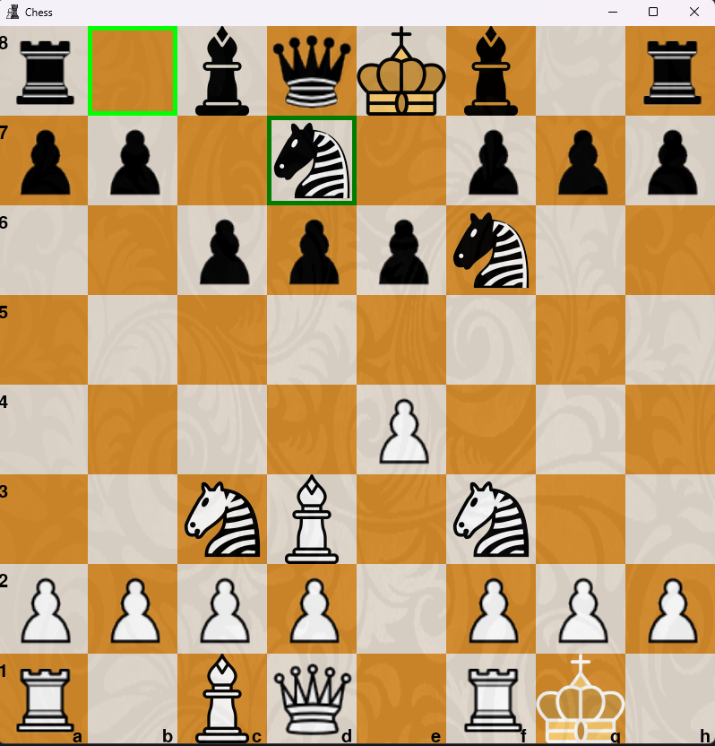
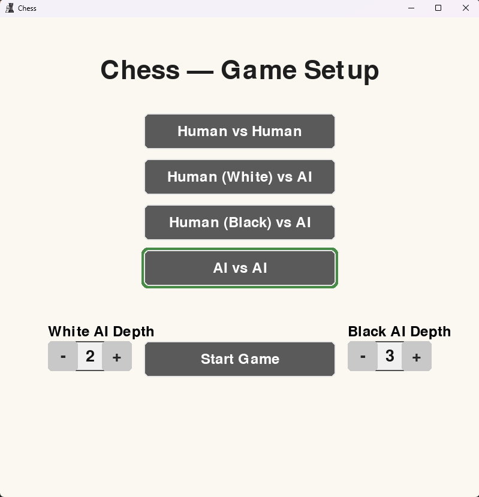

# ChessAI 

A chess game built with Python and Pygame.  
Play against a friend, against the AI, or watch two AIs battle it out.

---

## Features
- Human vs Human, Human vs AI, or AI vs AI modes  
- Configurable AI search depth (1–4)  
- Legal move generation, including castling and promotion  
- Board resizing, piece highlighting, and check alerts  
- Sound effects for moves, captures, and check  
- Undo functionality (press `U`)  

---

## Installation

### 1. Clone the repository
```bash
git clone https://github.com/BenjaminJose06/ChessAI.git
cd ChessAI
```

### 2. Install dependencies
```bash
pip install -r requirements.txt
```

### 3. Run the game
```bash
python main.py
```

---

## Screenshots
  


---

## Project Structure
```
ChessAI/
│── images/           # Chess piece graphics and board assets
│── sound/            # Sound effects
│── ChessAI.py        # AI logic
│── Move.py           # Move representation
│── board.py          # Board representation
│── constants.py      # Game constants
│── main.py           # Main entry point
│── requirements.txt  # Dependencies
│── README.md         # Project documentation
│── LICENSE           # License file
```
