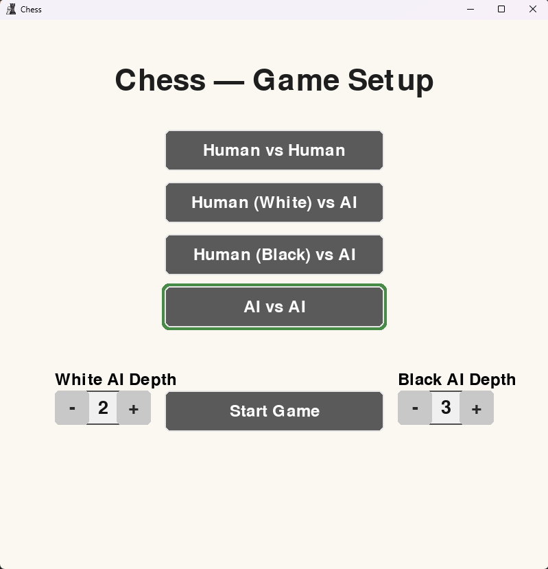
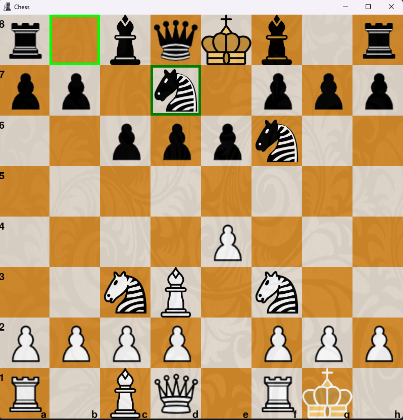

# ChessAI (PyGame)

A chess game built with Python and PyGame.  
Play against a friend, against the AI, or watch two AIs battle it out.

## Features
- Human vs Human, Human vs AI, AI vs AI modes
- Configurable search depth (1–4) for each AI side
- Pre-game menu for selecting mode and AI depth
- Legal move generation including castling and promotion
- Board resizing, piece highlighting, and check alerts
- Move/capture/check sound effects
- Undo (press `U`)

Note: Depth 4 may run slowly depending on your machine.

---

## Screenshots



---

## Installation

1. Clone the repo:
   ```bash
   git clone https://github.com/your-username/ChessAI.git
   cd ChessAI
